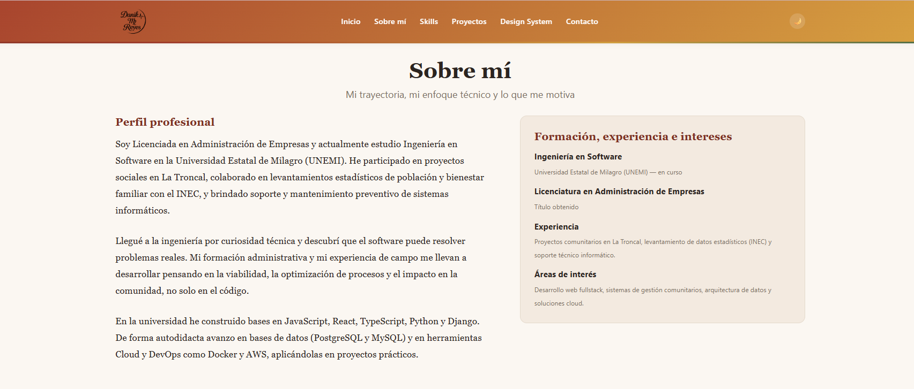
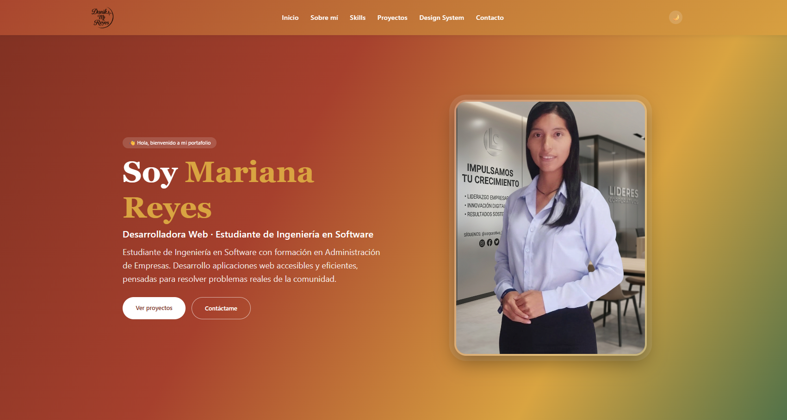
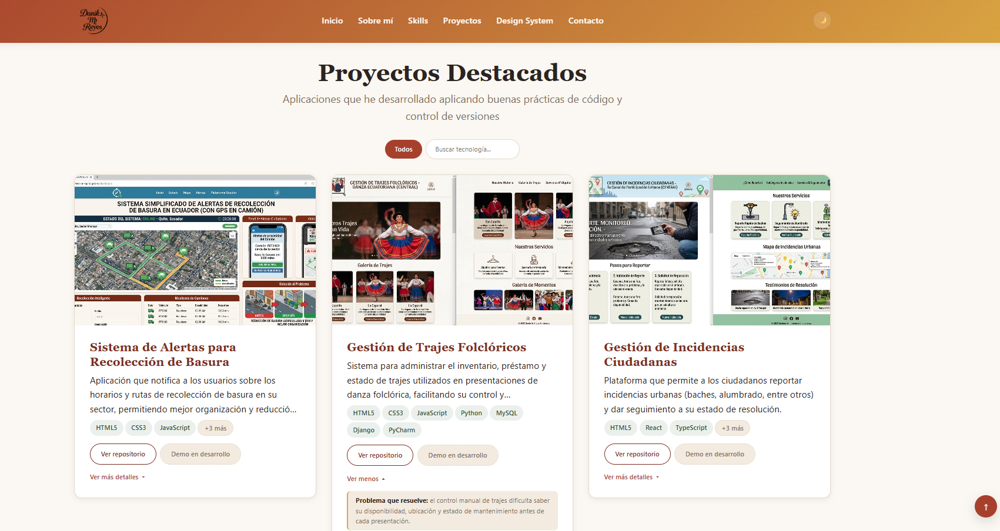
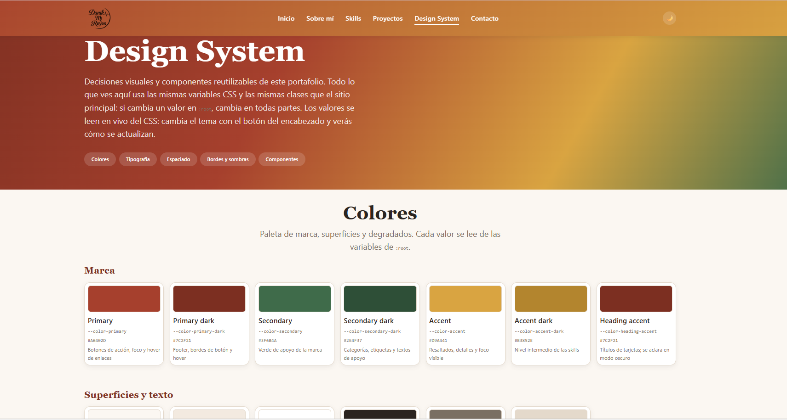
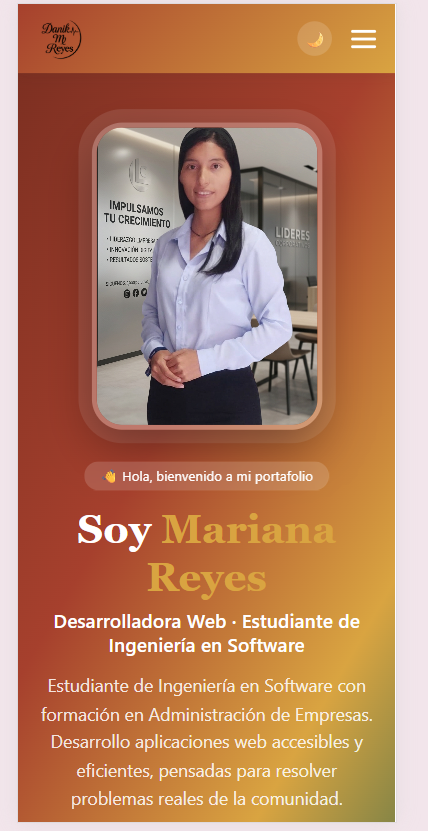

# Portafolio Web Profesional

Sitio web personal e interactivo de **Mariana Reyes**, estudiante de Ingeniería en Software y Licenciada en Administración de Empresas. Reúne su perfil, sus habilidades técnicas, sus proyectos destacados y una página de Design System que documenta las decisiones visuales del sitio.

Desarrollado desde cero con **HTML5, CSS3 y JavaScript**, sin frameworks ni librerías externas.

**[Ver el sitio en vivo](https://danikareyes.github.io/dk-portafolio-web/)** · **[Ver el Design System](https://danikareyes.github.io/dk-portafolio-web/design-system.html)**

---

## Capturas

| Inicio (tema claro) | Inicio (tema oscuro) |
| :---: | :---: |
|  |  |

| Proyectos destacados | Design System |
| :---: | :---: |
|  |  |

| Versión móvil |
| :---: |
|  |

---

## Secciones del sitio

| Sección | Contenido |
| --- | --- |
| **Inicio** | Presentación, perfil profesional y llamadas a la acción. |
| **Sobre mí** | Trayectoria, formación, experiencia e intereses. |
| **Skills** | Habilidades por categoría (Frontend, Backend, Bases de datos, Cloud y herramientas) con su nivel de dominio. |
| **Proyectos** | Tarjetas con problema que resuelve, tecnologías y enlace al repositorio, con filtro por tecnología. |
| **Design System** | Paleta, tipografía, espaciado, bordes, sombras y componentes reutilizables. |
| **Contacto** | Datos de contacto y formulario con validación. |

---

## Tecnologías

| Área | Herramientas |
| --- | --- |
| Estructura | HTML5 semántico (`header`, `nav`, `main`, `section`, `article`, `address`, `figure`, `footer`) |
| Estilos | CSS3 con Custom Properties, Flexbox, Grid, `clamp()`, media queries y `:has()` |
| Comportamiento | JavaScript (ES6+) sin librerías |
| Control de versiones | Git y GitHub |
| Publicación | GitHub Pages |
| Entorno | Visual Studio Code y la extensión Live Server |
| Íconos | [Devicon](https://devicon.dev) (SVG locales, sin dependencias externas) |

---

## Funcionalidades de JavaScript

1. **Menú responsive**: botón hamburguesa animado que se cierra al elegir una sección.
2. **Tema claro y oscuro**: se recuerda la preferencia con `localStorage`.
3. **Validación del formulario**: en tiempo real y al enviar, con mensajes de error y de estado accesibles.
4. **Marquee de skills**: cinta horizontal que se pausa al pasar el mouse y respeta `prefers-reduced-motion`.
5. **Filtro de proyectos**: botón «Todos» y buscador de tecnología con lista desplegable.
6. **Tarjetas de proyecto expandibles**: muestran lo esencial y despliegan el detalle bajo demanda.
7. **Botón «volver arriba»**: aparece al hacer scroll.

> El formulario valida los datos en el navegador. El envío real es opcional: se activa pegando una clave gratuita de [Web3Forms](https://web3forms.com) en `assets/js/main.js` (`WEB3FORMS_KEY`).

---

## Design System

La página [`design-system.html`](design-system.html) documenta el sistema visual y usa **exactamente los mismos estilos y componentes** que el sitio principal:

- **Colores**: marca, superficies, texto, degradados y transparencias.
- **Tipografía**: familias y jerarquía completa (h1, h2, h3, párrafos, texto secundario y enlaces).
- **Espaciado**: escala de cinco pasos y medidas fluidas.
- **Bordes y sombras**.
- **Componentes**: navbar, botones, skills, etiquetas, card de proyecto, tarjetas de contacto, inputs y textarea.

Los valores se leen en vivo de las variables CSS, así que la documentación nunca queda desactualizada.

---

## Estructura del proyecto

```text
dk-portafolio-web/
├── index.html
├── design-system.html
├── README.md
├── .gitignore
└── assets/
    ├── css/
    │   ├── styles.css          # Variables, base y componentes
    │   ├── responsive.css      # Solo lo que cambia en pantallas pequeñas
    │   └── design-system.css   # Solo el layout de la documentación
    ├── js/
    │   ├── main.js             # Comportamiento del sitio
    │   └── design-system.js    # Lectura en vivo de las variables CSS
    └── img/
        ├── icons/              # Íconos de tecnologías (SVG)
        ├── projects/           # Capturas de los proyectos
        └── screenshots/        # Capturas para este README
```

---

## Cómo visualizar el proyecto

No requiere instalación ni proceso de compilación.

**En línea:** abre <https://danikareyes.github.io/dk-portafolio-web/>.

**En tu computadora:**

```bash
git clone https://github.com/Danikareyes/dk-portafolio-web.git
cd dk-portafolio-web
```

Después, abre `index.html` con doble clic, o con **Live Server** desde Visual Studio Code (clic derecho sobre `index.html` → *Open with Live Server*).

Se recomienda un navegador actualizado (Chrome, Edge, Firefox o Safari).

---

## Decisiones de diseño y buenas prácticas

- **Estilos organizados por responsabilidad**: `styles.css` define variables y componentes, `responsive.css` contiene solo los cambios por tamaño de pantalla y `design-system.css` solo sirve a la documentación.
- **Variables CSS como única fuente de verdad**: colores, tipografía, espaciados, radios y sombras. El tema oscuro solo redefine los valores que cambian.
- **Diseño adaptable sin valores fijos**: tamaños de texto y medidas fluidas con `clamp()`, y tres puntos de quiebre (1024, 768 y 480 px) para computadoras, tablets y teléfonos.
- **Sin dependencias externas**: fuentes del sistema, íconos SVG locales y JavaScript sin librerías, lo que mejora la velocidad y evita fallos por conexión.
- **Accesibilidad**: HTML semántico, `label` en cada campo, `aria-live` en los mensajes, foco visible con teclado, textos alternativos y respeto a `prefers-reduced-motion`.
- **Código mantenible**: reglas de validación declaradas como datos, delegación de eventos y una función reutilizable para cada comportamiento.
- **Control de versiones**: historial de commits por hito de trabajo.

---

## Proyectos destacados

| Proyecto | Repositorio |
| --- | --- |
| Sistema de Alertas para Recolección de Basura | [alertas-recoleccion-basura](https://github.com/Danikareyes/alertas-recoleccion-basura) |
| Gestión de Trajes Folclóricos | [gestion-trajes-folcloricos](https://github.com/Danikareyes/gestion-trajes-folcloricos) |
| Gestión de Incidencias Ciudadanas | [gestion-incidencias-ciudadanas](https://github.com/Danikareyes/gestion-incidencias-ciudadanas) |

---

## Autora y créditos

Desarrollado por **Mariana Reyes** · GitHub: [@Danikareyes](https://github.com/Danikareyes)

Los íconos de tecnologías provienen de [Devicon](https://devicon.dev) (licencia MIT); las marcas pertenecen a sus respectivos dueños.